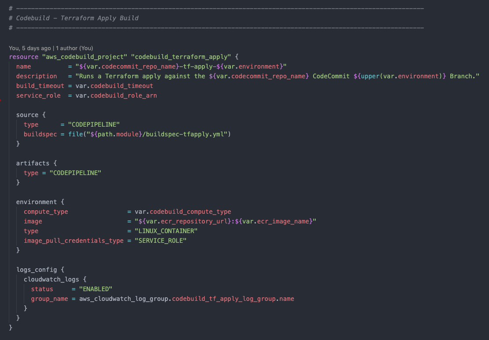
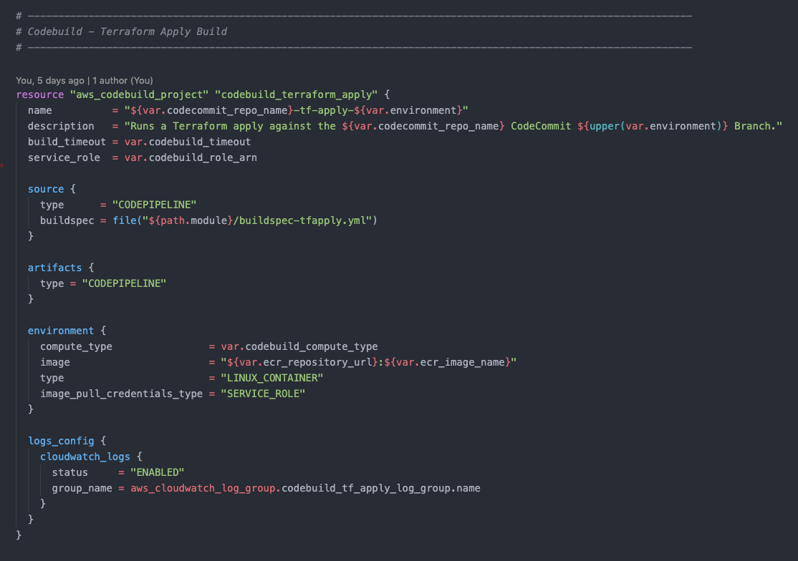

# Features

Dramatically improves syntax highlighting for Terraform `.tf` and `.tfvars` files (**including all syntax changes new to Terraform 0.12**).

## Before / After

## How do you use it?

Most themes are supported by default. Just install this VS Code extension and you'll immediately notice improved syntax highlighting for your Terraform files.

If you do notice an issue with your theme, please take a look at the following guide: https://code.visualstudio.com/api/language-extensions/syntax-highlight-guide.

## Improvements

Notice any issues, or have an idea on how this extension can improve? Please let me know!

Happy Coding! :)
~ Patrick